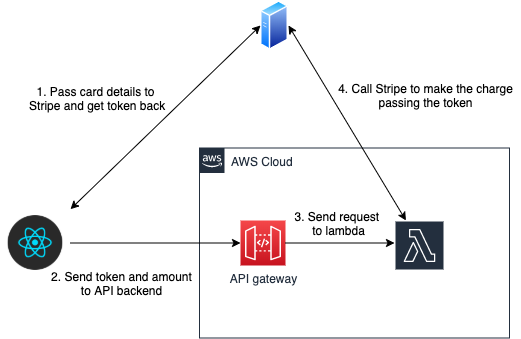

## Process payments with Stripe, React, and Framework7

This project provides a minimal example of using Stripe to process a payment from a web app. The web app is
written using the React version of the awesome [Framework7 framework](https://framework7.io/), so provides a
seamless mobile experience (including native like controls on IOS and Android) either as a PWA, or wrapped up in
Cordova, or equally as a desktop web app.

The beauty of using a service like Stripe to process payments is that it frees you from the compliance requirements
that come with storing card data yourself. Since no payment data is stored within the system, you are free from PCI DSS
requirements.

### Architecture
The project consists of a webapp frontend, and a simple backend implemented in a Node.js lambda that communicates 
with Stripe to create the actual charge, using the API secret key which is not publishable. 
The architecture is illustrated in the diagram below, showing the sequence
of events when a charge is created

1. The user enters their card details which are sent directly to Stripe (using the publishable key of the account). Stripe returns a token to the frontend.
2. The token, together with the amount to charge, are sent to the application backend (in this case an API gateway endpoint in AWS)
3. The API gateway sends the request to a lambda
4. The lambda then calls Stripe (using the secret key of the account) to make the charge

### Instructions
Before running the application, you will need to sign up for a Stripe account, and get the 2 API keys from the Stripe
developer console, namely the **publishable key** and the **secret key**.

The publishable key needs to be placed in the frontend code, in the following file

`src/index.js`

Once you have deployed the backend, you will also need to update the API gateway endpoint, and API key in the following file

`src/store/sagas/stripe.js`

The secret key (which must never be in publically accessible assets) needs to be placed in the lambda code, in the following file

`backend/aws/index.js`

#### Backend
To create the backend infrastructure, you will need an AWS account, with the CLI configured, and the [Serverless framework](https://serverless.com/)
installed. You can then run the following commands to deploy the lambda and gateway:

`cd backend/aws`

`npm install`

`serverless deploy --stage <STAGE_NAME>`

Make a note of the API endpoint and API key and update the saga file described above.

### Frontend
To run a development server for the frontend, simply run

`npm install`

`npm run start`

You can then access the app at http://localhost:8080. There is a single button named **Checkout** which will take you 
to a page on which you can enter card details. Clicking pay